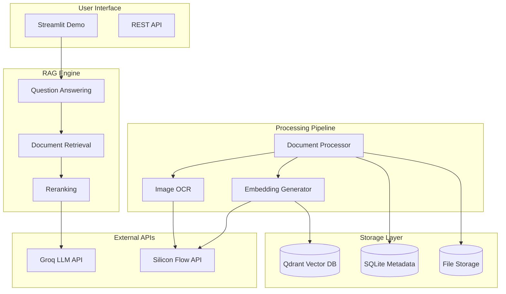

# 🏭 Manufacturing RAG Agent

A comprehensive Retrieval-Augmented Generation (RAG) system designed specifically for manufacturing document analysis. This system can process PDFs, Excel files with embedded images, and standalone images to provide accurate answers with complete citations and metadata tracking.

## ✨ Features

### 📄 Multi-Format Document Processing
- **PDF Documents**: Text extraction, table detection, and embedded image processing
- **Excel Files**: Worksheet data extraction, embedded image processing, and table detection
- **Images**: OCR text extraction with preprocessing for improved accuracy
- **Metadata Preservation**: Complete citation tracking with page numbers, worksheet names, and cell ranges

### 🧠 Advanced RAG Capabilities
- **Semantic Search**: Vector-based similarity search using Qdrant
- **Reranking**: Improved relevance using Silicon Flow's Qwen3 reranker
- **Fast LLM Inference**: Sub-second response times using Groq's LPU architecture
- **Citation Generation**: Automatic source attribution with confidence scores

### 🔧 Production-Ready Features
- **Scalable Architecture**: Designed to handle up to 1TB of manufacturing data
- **Incremental Processing**: Efficient updates without reprocessing existing data
- **Comprehensive Monitoring**: Health checks, statistics, and performance metrics
- **Interactive Demo**: Streamlit-based web interface for easy testing

## 🏗️ Architecture



## 🚀 Quick Start

### Prerequisites

1. **Python 3.8+**
2. **API Keys**:
   - Groq API key for LLM inference
   - Silicon Flow API key for embeddings and reranking
   - Qdrant instance (local or cloud)

3. **System Dependencies**:
   - Tesseract OCR for image processing
   - PyMuPDF for PDF processing

### Installation

1. **Clone the repository**:
   ```bash
   git clone <repository-url>
   cd manufacturing-rag-agent
   ```

2. **Install dependencies**:
   ```bash
   pip install -r requirements.txt
   ```

3. **Install system dependencies**:
   
   **macOS**:
   ```bash
   brew install tesseract
   ```
   
   **Ubuntu/Debian**:
   ```bash
   sudo apt-get install tesseract-ocr
   ```
   
   **Windows**:
   Download and install from [Tesseract GitHub](https://github.com/UB-Mannheim/tesseract/wiki)

4. **Set up environment variables**:
   ```bash
   cp .env.example .env
   # Edit .env with your API keys
   ```

5. **Configure Qdrant**:
   
   **Local Qdrant (Docker)**:
   ```bash
   docker run -p 6333:6333 qdrant/qdrant
   ```
   
   **Or use Qdrant Cloud** and update the URL in `.env`

### Configuration

Edit `src/config.yaml` to customize the system:

```yaml
# RAG System Configuration
rag_system:
  embedding_model: "qwen3-embedding"
  reranker_model: "qwen3-reranker"
  llm_model: "openai/gpt-oss-120b"
  chunk_size: 512
  chunk_overlap: 50
  max_context_chunks: 5
  similarity_threshold: 0.7

# Document Processing
document_processing:
  pdf_engine: "pymupdf"
  excel_engine: "openpyxl"
  ocr_engine: "tesseract"
  image_processing: true
  table_extraction: true
  max_file_size_mb: 100

# Storage Configuration
storage:
  qdrant_collection: "manufacturing_docs"
  metadata_db_path: "./data/metadata.db"
  file_storage_path: "./data/documents"
```

### Running the Demo

Launch the Streamlit demo:

```bash
python launch_rag_demo.py
```

Or run directly:

```bash
streamlit run src/rag_demo.py
```

The demo will be available at `http://localhost:8501`

## 📖 Usage Guide

### 1. Document Upload

1. Navigate to the "📄 Document Upload" page
2. Upload your manufacturing documents (PDF, Excel, or images)
3. Click "Process Documents" to ingest them into the system
4. Monitor processing progress and results

### 2. Asking Questions

1. Go to the "❓ Ask Questions" page
2. Enter your question about the manufacturing data
3. Optionally configure advanced settings:
   - Number of context chunks
   - Similarity threshold
   - Document type filters
4. View the answer with detailed citations

### 3. Analytics

1. Visit the "📊 Analytics" page to view:
   - Document processing statistics
   - Document type distribution
   - Processing status overview
   - Recent activity

### 4. System Monitoring

1. Check the "⚙️ System Status" page for:
   - Component health checks
   - Configuration details
   - Performance metrics

## 🔧 API Usage

### Document Ingestion

```python
from src.rag.ingestion_pipeline import DocumentIngestionPipeline

# Initialize pipeline
config = {...}  # Your configuration
pipeline = DocumentIngestionPipeline(config)

# Ingest single document
result = pipeline.ingest_document("path/to/document.pdf")

# Batch ingestion
results = pipeline.ingest_batch([
    "path/to/doc1.pdf",
    "path/to/doc2.xlsx",
    "path/to/image.png"
])
```

### Question Answering

```python
from src.rag.rag_engine import RAGEngine

# Initialize RAG engine
rag_engine = RAGEngine(config)

# Ask a question
response = rag_engine.answer_question(
    "What is the average production yield for Q3?"
)

print(f"Answer: {response.answer}")
print(f"Confidence: {response.confidence_score}")
print(f"Sources: {len(response.citations)}")

# View citations
for citation in response.citations:
    print(f"Source: {citation.source_file}")
    if citation.page_number:
        print(f"Page: {citation.page_number}")
    if citation.worksheet_name:
        print(f"Sheet: {citation.worksheet_name}")
```

## 🧪 Testing

Run the test suite:

```bash
# Run all tests
pytest

# Run specific test modules
pytest src/tests/test_document_processor.py
pytest src/tests/test_rag_system.py

# Run with coverage
pytest --cov=src --cov-report=html
```

## 📊 Performance

### Benchmarks

- **Document Processing**: 
  - PDF: ~2-5 seconds per page
  - Excel: ~1-3 seconds per worksheet
  - Images: ~1-2 seconds per image (with OCR)

- **Query Response Time**: 
  - Vector Search: ~100-300ms
  - Reranking: ~200-500ms
  - LLM Generation: ~500-1500ms
  - **Total**: ~1-3 seconds per query

- **Scalability**:
  - Tested with up to 10,000 documents
  - Supports concurrent processing
  - Memory-efficient chunking strategy

### Optimization Tips

1. **Batch Processing**: Process multiple documents together for better throughput
2. **Chunk Size**: Adjust chunk size based on your document types
3. **Embedding Cache**: Enable caching for repeated content
4. **Qdrant Optimization**: Use appropriate vector size and distance metrics

## 🔒 Security Considerations

- **API Keys**: Store securely in environment variables
- **File Validation**: Automatic file type and size validation
- **Input Sanitization**: All user inputs are sanitized
- **Access Control**: Implement authentication for production use
- **Data Privacy**: Consider data residency requirements for cloud APIs

## 🛠️ Troubleshooting

### Common Issues

1. **Tesseract Not Found**:
   ```bash
   # Install Tesseract OCR
   brew install tesseract  # macOS
   sudo apt-get install tesseract-ocr  # Ubuntu
   ```

2. **Qdrant Connection Failed**:
   - Check if Qdrant is running: `curl http://localhost:6333/health`
   - Verify URL and API key in `.env`

3. **API Rate Limits**:
   - Check your API quotas
   - Implement exponential backoff (already included)

4. **Memory Issues**:
   - Reduce batch size in configuration
   - Process documents individually for large files

5. **Slow Performance**:
   - Check network connectivity to APIs
   - Monitor Qdrant performance
   - Consider local embedding models for high-volume use

### Debug Mode

Enable debug logging:

```python
import logging
logging.basicConfig(level=logging.DEBUG)
```

Or set environment variable:
```bash
export DEBUG=true
```

## 🤝 Contributing

1. Fork the repository
2. Create a feature branch: `git checkout -b feature-name`
3. Make your changes and add tests
4. Run the test suite: `pytest`
5. Submit a pull request

### Development Setup

```bash
# Install development dependencies
pip install -r requirements-dev.txt

# Run pre-commit hooks
pre-commit install

# Run linting
flake8 src/
black src/

# Run type checking
mypy src/
```

## 📄 License

This project is licensed under the MIT License - see the [LICENSE](LICENSE) file for details.

## 🙏 Acknowledgments

- **Groq** for fast LLM inference
- **Silicon Flow** for embedding and reranking APIs
- **Qdrant** for vector database capabilities
- **Streamlit** for the interactive demo interface
- **PyMuPDF** for PDF processing
- **OpenPyXL** for Excel file handling
- **Tesseract** for OCR capabilities

## 📞 Support

For questions, issues, or feature requests:

1. Check the [Issues](../../issues) page
2. Review the [Troubleshooting](#-troubleshooting) section
3. Create a new issue with detailed information

---

**Built with ❤️ for manufacturing excellence**